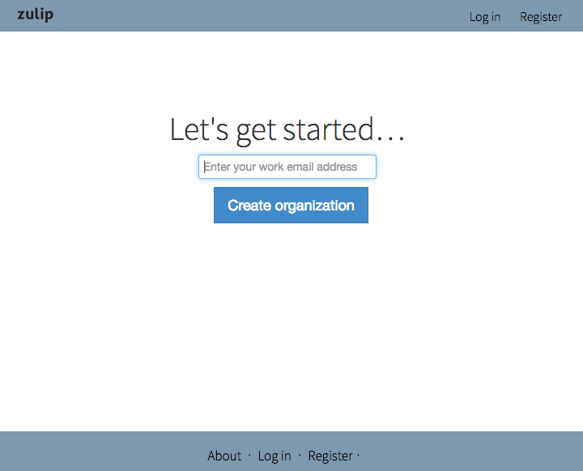
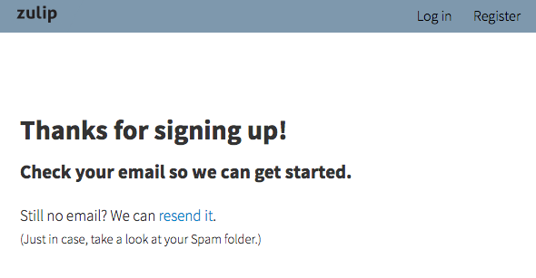
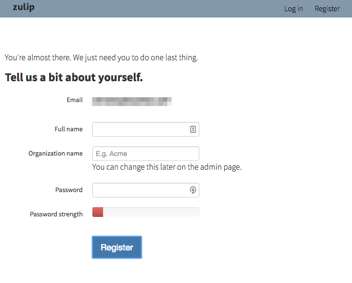

# Log in and create users

(As you read and follow the instructions in this section, if you run
into trouble, check out the troubleshooting advice in [the next major
section](prod-health-check-debug.html).)

Once you've finished installing Zulip, configuring your `settings.py`
file, and initializing the database, it's time to create your organization and
your user.

## Create your organization and user

You create your organization and user from the Zulip web app via a unique,
one-time link you create with the Zulip management console, `manage.py`:

```
cd deployments/current
./manage.py generate_realm_creation_link
```

Note: You always need to run `manage.py` as the Zulip user. To start an interactive
shell as the Zulip user, use `sudo -u zulip -i`.

Open the link generated with your web browser. You'll see the create realm
(organization) page:



Enter your email address. You should use an address that matches the domain
with which you want this realm (organization) to be associated.

Once you provide your email address, click *Create organization* and you'll be
emailed a confirmation link.



Check your email and click this link. You'll be prompted to finish setting up
your organization and your user:



Complete this form and you'll be ready to log in!

Your user will automatically have administrator access. You will have a special
"Administration" tab linked to from the upper-right gear menu in the Zulip app
that lets you deactivate other users, manage streams, change the Realm
settings, etc.


Congratulations!  You now have a fully operational Zulip organization.

Next, you'll want to do one of the following:

* [Configure your Zulip organization](prod-customize.html).
* [Learn about managing a production Zulip server](prod-maintain-secure-upgrade.html).

## Troubleshooting

If you get an error while trying to sign in, check
`/var/log/zulip/errors.log` for a traceback, and consult the
[troubleshooting section](prod-health-check-debug.html) for advice on
how to debug.  If that doesn't help, please visit [the `installation
help` stream in the Zulip developers'
chat](https://zulip.tabbott.net/#narrow/stream/installation.20help)
for realtime help or email zulip-help@googlegroups.com with the
traceback and we'll try to help you out!

